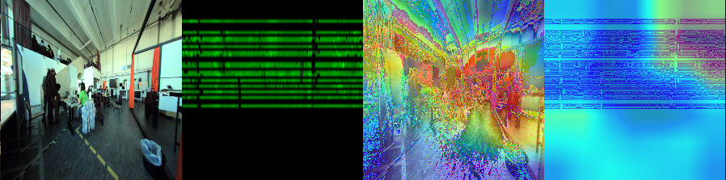
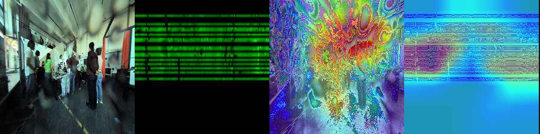
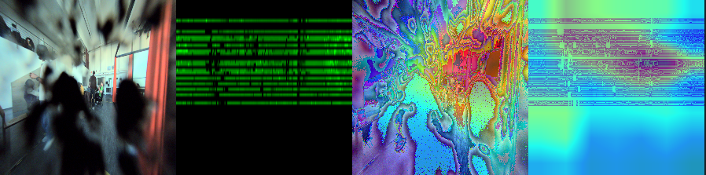

# AMT_HackMining_Sick
ROS2 Multimodal Contamination Detection System 🚦

--------------------------------------------------

OVERVIEW

This project implements a real-time multimodal contamination detection pipeline using LiDAR and Camera data within a ROS2 framework. The system estimates environmental contamination levels and outputs a unified traffic-light state.

The pipeline combines:
- Sensor-based perception (LiDAR + Camera)
- Deep learning-based multimodal classification
- Rule-based statistical fusion for robust real-time decisions

--------------------------------------------------

FINAL OUTPUT STATES

- 🟢 NORMAL (Clean)
- 🟡 REDUCED (Moderate contamination)
- 🔴 CRITICAL (Severe contamination)

--------------------------------------------------

DEMO VIDEO
<video controls src="WhatsApp Video 2026-05-06 at 13.29.58.mp4" title="Title"></video>

--------------------------------------------------

GRADCAM OUTPUT FOR STATES:

NORMAL:

REDUCED:

CRITICAL:

--------------------------------------------------

FULL SYSTEM ARCHITECTURE

--------------------------------------------------

MODEL ARCHITECTURE (ML PIPELINE)

Dual-Branch Multimodal Learning:

- Two parallel CNN branches (dual-branch ResNet)
- Each learns modality-specific features
- Late fusion at feature level
- Output: contamination class (Clean / Caution / Dirty)

--------------------------------------------------

MY CONTRIBUTIONS

1. DATA EXTRACTION (extractor.py)

- Parsed ROS2 bag files using rosbag2_py
- Extracted synchronized:
  - LiDAR PointCloud2
  - Camera images
- Converted LiDAR → Range Images:
  - Spherical projection (azimuth, elevation)
  - Generated dense 2D representation
- Applied preprocessing:
  - Resizing (224×224)
  - Normalization
  - Orientation correction (flip)
- Generated structured dataset:
  - 12,000+ labeled samples
  - Classes: clean / caution / dirty

--------------------------------------------------

2. MODEL TRAINING (train.py)

- Designed dual-branch ResNet-based architecture
- Parallel feature learning for:
  - LiDAR range images
  - Camera images
- Implemented:
  - Late fusion for multimodal representation
  - Classification head for contamination states
- Trained on extracted dataset
- Validated using:
  - Grad-CAM for interpretability
  - Verified model attention regions

--------------------------------------------------

3. ML INFERENCE NODE (ros_multi_modal_detector.py)

- Integrated trained model into ROS pipeline
- Real-time inference on incoming sensor data
- Outputs prediction scores for fusion

--------------------------------------------------

4. FUSION LOGIC (fusion_node.py)

- Combined:
  - LiDAR rule-based score
  - Camera score
  - ML prediction
- Implemented:
  - Weighted fusion
  - Temporal smoothing (sliding window)
  - Consensus logic
  - State machine transitions
  - Cooldown mechanism to avoid flickering
- Output mapped to traffic-light states

--------------------------------------------------

BASELINE CONTAMINATION NODE

- Rule-based LiDAR + Camera contamination estimation
- Includes:
  - Intensity thresholds (LiDAR)
  - Blur (Laplacian variance) + brightness (Camera)
- For full details, refer to this:
  [Repository](https://github.com/utkarshanand140/sensor-contamination-detection-ros2)

--------------------------------------------------

PROJECT STRUCTURE

.
├── contamination_demo/          (ROS2 package)
│   └── contamination_monitor_node.py
├── extractor.py                 (Data extraction)
├── train.py                     (Model training)
├── ros_multi_modal_detector.py  (ML inference node)
├── fusion_node.py               (Fusion logic)
├── Dockerfile                   (Optional)
├── README.txt

--------------------------------------------------

ROS TOPICS

Subscribed:
- /lidar/cloud/device_id47
- /visionary2/bgr/device_id4

Published:
- /contamination_status (String)
- /trafic_light_color_raw (Int32)
--------------------------------------------------

HOW TO RUN

1. Build workspace:
   colcon build
   source install/setup.bash

2. Run contamination node:
   ros2 run contamination_demo contamination_monitor_node

3. Run ML node:
   python3 ros_multi_modal_detector.py

4. Run fusion node:
   python3 fusion_node.py

5. Play rosbag or Live sensor feed:
   ros2 bag play <bag_file>

--------------------------------------------------

REQUIREMENTS

- ROS2 (Jazzy/Kilted)
- Python 3
- NumPy
- OpenCV
- PyTorch

Install:
pip install numpy opencv-python torch torchvision

--------------------------------------------------

RESULTS

- Real-time contamination detection pipeline
- Multimodal learning improves robustness
- Stable outputs via temporal + rule-based fusion

--------------------------------------------------

- Grad-CAM Visualizations: [Add Images]
- Project Presentation (PPT): [Add Link]

--------------------------------------------------

NOTES

- Ignore folders:
  build/
  install/
  log/
  venv/

- Ensure active ROS topics (use rosbag if needed)

--------------------------------------------------

FUTURE IMPROVEMENTS

- Sensor calibration (LiDAR ↔ Camera alignment)
- Better temporal synchronization
- Higher resolution range representations
- End-to-end fusion learning (deep fusion)
- Visualization dashboard

--------------------------------------------------

AUTHORS

- Vishnucharan S
- Utkarsh Anand
- Saimothish
- Kishore

--------------------------------------------------